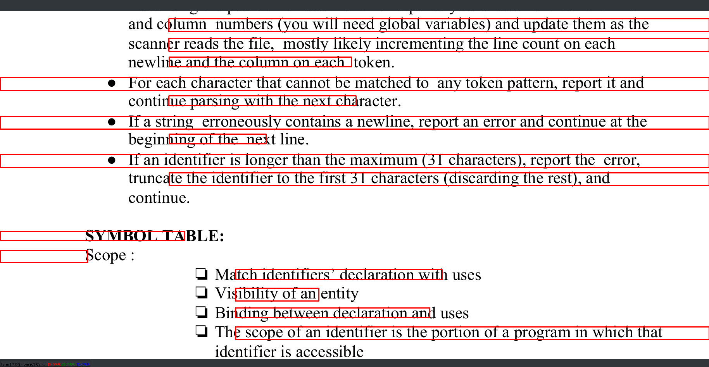

# Text Extraction from Videos and Images using OpenCV
This task is an implementation of a text extractor in OpenCV that uses the Watershed Segmentation technique and the EAST Text Detection Model available in OpenCV to extract textual content from video frames.

## Watershed Segmentation Approach
The watershed segmentation algorithm available in OpenCV is used to segment the input frame into lines of text. Bounding boxes are constructed around the text which is extracted from the frames using pytesseract.The Watershed approach is more reliable with binarised images and often fails with inputs having a wide spectrum of colours.The steps involved in this approach are:

- Preprocessing the input frame through dilation and erosion
- Applying 4-way connectivity labelling to the preprocessed frame
- Applying Watershed Segmentation to the image with the markers
- Constructing bounding boxes around contours of sufficient area

## EAST Text Detection
This approach makes use of the pre-trained EAST deep learning network that is available in OpenCV. The steps involved in this approach are:
- Resizing the image to dimensions which are multiples of 32
- Computing the ration for this dimension change
- Creating a blob from the image which performs mean subtraction and channel swapping
- Forward pass of the EAST model to obtain predictions
- Parsing outputs to generating bounding box coordinates

# Sample Outputs

<table>
    <tr>
        <td colspan = "2" align = "center" > (a) Sample Bounding Boxes constructed using the Watershed Segmentation Technique </td>
    </tr>
    <tr>
        <td></td>
        <td></td>
    </tr>
    <tr>
        <td colspan = "2" align = "center" > (b) Sample Bounding Boxes constructed using the EAST Approach </td>
    </tr>
    <tr>
        <td></td>
        <td></td>
    </tr>
 </table>

 # Setup

- Clone the repository
- Install the package locally using the following command
```bash
pip install -e text-extraction/
```

# Usage
- Run the main file using the following command, where `<option>` is `1` for the Watershed Segmentation approach and `2` for the EAST approach, and `<video_path>` is the path to the video files under `src/Videos`.
```bash
python3 src/main.py <option> <video_path>
```

- The individual files can be run using the below command, where `<file>` can be `detect_east` or `detect_watershed`.:
```bash
python3 src/<file>.py
```

 ## References
 - Watershed Segmentation Tutorial : [OpenCV-Python-Tutorials](https://opencv-python-tutroals.readthedocs.io/en/latest/py_tutorials/py_imgproc/py_watershed/py_watershed.html)
 - [EAST Deep Neural Network for Text Detection](https://arxiv.org/abs/1704.03155)
 - Pyimagesearch : [EAST Text Detection](https://www.pyimagesearch.com/2018/08/20/opencv-text-detection-east-text-detector/)
